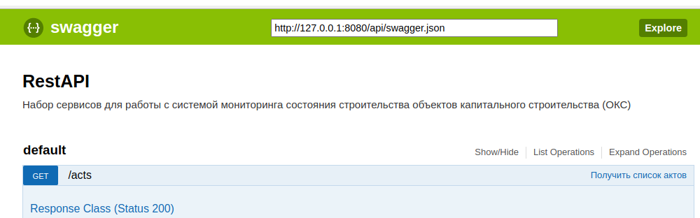
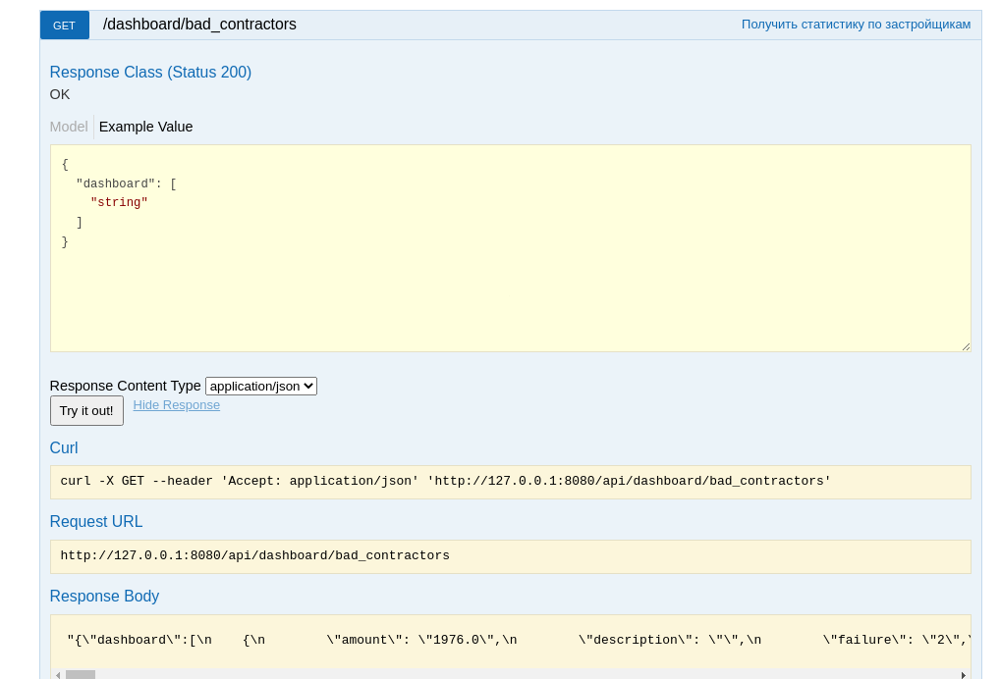

#### Краткая программа курса
# Построение витрин данных на основе Yandex.ClickHouse

Стек: `python`, `Yandex.ClickHouse`, `swagger\OpenApi`, `JavaScript\bootstrap`

### Легенда
>	Вы включены в команду разработки дополнительного программного обеспечения для проведения мониторинга всех этапов строительства
>на промышленной площадке. В настоящее время, у Вас в организации есть ERP система полного цикла которая позволяет вести учет всех данных
>связанных со строительством любых объектов. Однако, для проведения каждого этапа аудита требуется выезд на объект группы специалистов
>для оценки прогресса. Далее, составляется акт на бумажном носителе, Данный акт и набор документов рассылается всем субподрядчикам. 
>	Каждый субподрядчик, проверяет документы и ведет диалог с контроллирующим органом. Для ускорения данного процесса и повышения
>`прозрачности` деятельности принято решение расширить текущую ERP систему путем создание внешнего модуля (Rest Api) и отдельного WEB приложения (личный кабинет субподрядчика).
>	Так же, ввиду того, что требуется не только хранить всю историю работы но и проводить анализ данных на предмет качества работы
>каждого субподрядчика, принято решение, включить во внешний модуль часть аналитики на основе облачной платформы [Yandex.ClickHouse](https://yandex.ru/dev/clickhouse/)


### Подготовка
1. Установить ClickHouse - https://clickhouse.com/docs/en/install
2. Установить Visual Studio Code - https://code.visualstudio.com/download
	- Установить плагины: Python, PyTest (`ms-python.python`, `littlefoxteam.vscode-python-test-adapter` ,`pamaron.pytest-runner`)
3. Установить pip утилиту `sudo apt install python3-pip`
	- Установить расширение для Python `pip install clickhouse-connect`
    - Установить драйвер для работы `pip install clickhouse-driver`

### Основные объекты

Основными сущностями в проекте будут считаться: `объект капитального строительства`, `застройщик`, `субподрядчик`, `исполнитель`
Приложение должно оперировать следующими документами: `акт`, `реектр актов`
В рамках каждого документа назначается оценка состояния: `сумма штрафа`, `статус работ`

Определим статусы объекта:

| Статус        | Описание                |
|---------------|-------------------------|
| Подготовка    | Все документы для начала строительства / этапа собраны и проверены. Разрешения выданы |
| Старт         | На объекте начаты строительные работы. Представители субподрядчика прибыли на объект |
| Проверка пройдена | Очередная проверка пройдена без замечаний со стороны контроллирующих органов |
| Замечания | Очередная проверка пройдена с замечаниями. Необходимо устранить все замечания |
| Завершено | Все замечания устранены. Все проверки пройдены. Оплату можно проводить |

### Архитектура

Выбираем вариант - [многослойная архитектура](https://ru.wikipedia.org/wiki/%D0%9C%D0%BD%D0%BE%D0%B3%D0%BE%D1%83%D1%80%D0%BE%D0%B2%D0%BD%D0%B5%D0%B2%D0%B0%D1%8F_%D0%B0%D1%80%D1%85%D0%B8%D1%82%D0%B5%D0%BA%D1%82%D1%83%D1%80%D0%B0)
В проекте будем разделять модели на: `основные`, `для передачи и обработки данных`
Создадим пустой проект и добавим каталоги: `Src/Models`, `Tests`

Создадим основные модели.

| Модель          | Наименование           |
|-----------------|------------------------|
| [progress_status](../Src/Models/Statuses.py)  | Описание статусов  |
| [building](../Src/Models/Building.py) | Объект капитального строительства |
| [contractor](../Src/Models/Contractor.py) | Застройщик / Подрядчик / Субподрядчик |
| [executor](../Src/Models/Executor.py)  | Исполнитель   |
| [act](../Src/Models/Act.py)  | Документ **Акт проверки** |
| | |
| [period](../Src/Models/Period.py) | Обвертка для работы с датой-временем |
| [guid](../Src/Models/Guid.py) | Обвертка для работы с уникальным кодом |
| | |

Так же, добавим [модульные тесты](../Tests/test_models.py).

### Проектирование основных сервисов

> Подготовка
Устанавливаем модуль [connexion](https://connexion.readthedocs.io/en/latest/) для разработки WEB сервисов `REST API`
```
pip install connexion[swagger-ui]
```

Добавим вызовы [RestApi](../Main.py) с свяжем их со специальных классом - [репозиторий](../Src/Services/Repo.py).

| Url (endpoint)   | Описание                    |
|------------------|-----------------------------|
| /api/acts/       | **GET**, получить список всех актов |
| /api/acts/uid    | **GET**, получить карточку конкретного акта по его коду  |
| /api/executors/   | **GET**, получить список всех исполнителей |
| /api/executors/uid | **GET**, получить карточку конкретного исполнителя по его коду |
| /api/contractors/ | **GET**, получить список всех застройщиков |
| /api/contractors/uid | **GET**, получить карточку конкретного застройщика по его коду |
| | | 


Так же, добавим [модульные тесты](../Tests/test_reposity.py) и тесты на [конвертацию данных](../Tests/test_to_json.py) в формат json
Для проверки работы RestApi  в класс репозиторий добавим демо данные. Удобней это сделать при помощи фабричного метода. 
Пример:

```python
def create(is_demo = False):
        """
        Фабричный метод
        """
        main = repo()
        if is_demo == True:
            main.load_demo()
        else:    
            main.load()

        return main
```

Для работы с API создадим специальный [yaml файл](../Swagger.yaml) в котором создадим описание всех точек вызова. Для проверки, запускаем: http://127.0.0.1:8080/api/ui



#### Задания
1. Доработать [yaml файл](../Swagger.yaml). Включить в него описания вызовов для остальных сервисов. Пример: https://swagger.io/docs/specification/basic-structure/
2. Найти ошибку в коде. При сериализации объекта [executor](../Src/Models/Executor.py) значения поля `contractor` выглядит следующим образом:
```json
 "contra\u0441tor": {
                "description": "",
                "guid": "3de8f7f4-7e4b-4d91-8bfd-a3cfd00bfbf4",
                "name": "test2"
 }
 ```
 3. Написать простой **Js** код, который будет отображать данные от `RestApi`. Желательно, использовать систему генерации **Js** кода, например: https://github.com/RicoSuter/NSwag
 4. Доработать метод `load_demo` класса [repo](../Src/Services/Repo.py). Добавить в него генерацию всех сущностей.
 5. Доработать модель [акта](../Src/Models/Act.py). Добавить свойство - объект капитального строительства (ОКС), [building](../Src/Models/Building.py)
 

### Проектирование базы данных
#### ClickHouse

Подключение:
```
clickhouse-client --host rc1a-7ut3ob6t69958voj.mdb.yandexcloud.net                   --secure                   --user user                   --database db                   --port 9440                   --ask-password
```

При удачном подключении:
```
rc1a-7ut3ob6t69958voj.mdb.yandexcloud.net :)
```

Таблицы:
| Наименование                 | Описание                | SQL запрос                     |
|------------------------------|-------------------------|--------------------------------|
| `buildings`                  | Таблица всех объектов капитального строительства (ОКС) | `create table buildings(id UUID, name String, description String, primary key[id]) engine = MergeTree;` | 
| `statuses`                   | Таблица статусов | `create table statuses(id UUID, code Int, name String, description String, primary key[id]) engine = MergeTree;` |
| `executors`                  | Таблица исполнителей | `create table executors(id UUID, name String, description String, contractor_id UUID not null, primary key[id]) engine = MergeTree;` |
| `contractors`                | Таблица застройщиков | `create table contractors(id UUID, parent_id UUID, name String,description String, primary key[id]) engine = MergeTree;` |
| `acts`                       | Таблица с основной информацией по актам | `create table acts(id UUID, building_id UUID not Null, executor_id UUID,  period DateTime not null,  primary key[id]) engine = MergeTree;` |
| `acts_contractor_links`      | Таблица связи акта с застройщиками | `create table acts_contractors_links(id UUID, period DateTime not null, contractor_id UUID not null,  primary key[id]) engine = MergeTree;` |
| `acts_status_links`          | Таблица связи акта со статусом | `create table acts_status_links(id UUID, period DateTime not null, status_code Int not null, comments String, amount  Float32 default(0), primary key[id]) engine = MergeTree` |
| | | |


Проверка:
```sql
show tables;

┌─name───────────────────┐
│ acts                   │
│ acts_contractors_links │
│ acts_status_links      │
│ buildings              │
│ contractors            │
│ executors              │
│ statuses               │
└────────────────────────┘
```

Добавим статусы:
```sql
insert into statuses(id, name, code, description) select generateUUIDv4(),'preparation',1, 'Все документы для начала строительства / этапа собраны и проверены. Разрешения выданы';
insert into statuses(id, name, code, description) select generateUUIDv4(),'start',2, 'На объекте начаты строительные работы. Представители субподрядчика прибыли на объект';
insert into statuses(id, name, code, description) select generateUUIDv4(),'passing',3, 'Очередная проверка пройдена без замечаний со стороны контроллирующих органов';
insert into statuses(id, name, code, description) select generateUUIDv4(),'failure',4, 'Очередная проверка пройдена с замечаниями. Необходимо устранить все замечания';
insert into statuses(id, name, code, description) select generateUUIDv4(),'finish',5, 'Все замечания устранены. Все проверки пройдены. Оплату можно проводить';
```

##### Задания
1. Доработать таблицу `statuses`. Исключить возможность дублирования записей по полям: **name**,**code**. Сделать в виде SQL скрипта в котором сразу же включить проверку.
2. Изенить таблицу `acts_status_links`. Сделать связь со статусом не по **UUID** , а по коду **Int**. Сделать в виде SQL скрипта.

#### Работа с ClickHouse

1. Установим [пакет](https://readthedocs.org/projects/clickhouse-driver/downloads/pdf/latest/) 
```
pip install clickhouse-driver
```

2. Создадим [отдельный класс](../Src/Services/Proxy.py) для работы с базой данных `proxy`. 
3. Так же, добавим для проверки [модульный тест](../Tests/test_proxy.py)
4. Для всех моделей добавим метод `__str__` и в каждом методе определим SQL команду для вставки данных. 

Пример:

```python
    def __str__(self):
        """
        Сформировать SQL запрос на вставку данных
        """
        sql = "insert into executors(id, name, description, contractor_id) values('%s', '%s', '%s', '%s')" % (self.id.toJSON(), self.name, self.description,  self.contraсtor.id.toJSON())
        return sql
```        

#### Генерация тестовых данных

1. Создадим [отдельный класс](../Generator.py) c автозапуском. Последовательно в нем реализуем генерацию всех моделей с засечкой времени выполнения.
2. Для фиксации времени выполнения добавим новый метод в модель `period`

Пример:
```
-> Генерация записей: buildings
Старт: 2023-05-08 13:39:54
Сформировано успешно 100 записей за 15.305252 сек.
-> Генерация записей: contractors
Старт: 2023-05-08 13:40:10
Сформировано успешно 100 записей за 15.028041 сек.
-> Генерация записей: executors
Старт: 2023-05-08 13:40:25
Сформировано успешно 100 записей за 14.503743 сек.
-> Генерация записей: acts
Старт: 2023-05-08 13:40:39
Сформировано успешно 50 записей за 555.550269 сек.
-> Генерация записей: acts_status_links
Старт: 2023-05-08 13:49:55
Сформировано успешно 25 записей за 357.434632 сек.
Генерация данных завершена за 959.044415 сек.
```

##### Задания
1. Вывести информацию в виде (создать SQL запрос):

| Код акта    |  Дата ввода документа  | Сумма штрафа   | Дата смены статуса   |  Наименование статуса  |
|-------------|------------------------|----------------|----------------------|------------------------|


2. Вывести информация в виде (составить SQL запрос):

| Код акта    |  Дата ввода документа  | Сумма штрафа   | Дата текущего статуса  |  Наименование текущего статуса  |
|-------------|------------------------|----------------|------------------------|---------------------------------|

3. Доработать код загрузки данных в файле [Repo.py](../Src/Services/Repo.py). Метод:
```python
  def load(self):
        """
        Подключиться к базе данных
        """
        self.__proxy = db_proxy()
        self.__proxy.open()
```

### Построение витрин данных
#### Проблемные застройщики

> Критерии:
> 1. Последний рабочий статус акта `failure` (код 4)
> 2. Имеют разные объекты строительства (ОКС)

```sql
with cte_acts as
(
    -- Список проблемных актов
     select id as act_id from ( select id, argMax(status_code, period) as status_code from acts_status_links group by id) as tt where tt.status_code = 4 
),
cte_buildings  as 
(
    -- Список проблемных застройщиков
    select t2.id as building_id, t2.name as building_name
    from acts as t1 
    inner join cte_acts as tt on tt.act_id = t1.id 
    inner join buildings as t2 on t1.building_id = t2.id
    group by t2.id, t2.name
),
cte_quantity_acts as
(
    -- Количество актов в работе по каждому застройщику
    select t1.building_id, count(*) as cnt_all from acts as t1 where t1.building_id in ( select building_id from cte_buildings)
    group by t1.building_id
),
cte_quantity_failure_acts as
(
    -- Количество актов по застройщикам, которые имеют проблемы
    select t1.building_id as building_id, count(*) as cnt_failure, sum(tt.amount) as amount from acts as t1
    left join ( select id as act_id, argMax(amount, period) as amount from acts_status_links where status_code = 4 group by id ) as tt on tt.act_id = t1.id
    where t1.id in (select act_id from cte_acts) 
    group by t1.building_id 
)

select concat('http://localhost:8080/api/contractors/',  toString(t1.building_id)) as link, t1.building_name as name,  t2.cnt_all as qauntity, t3.cnt_failure as failure, t3.amount from cte_buildings as t1
left join cte_quantity_acts as t2 on t1.building_id = t2.building_id
left join cte_quantity_failure_acts as t3 on t3.building_id = t1.building_id
order by t2.cnt_all, t3.cnt_failure, t3.amount desc;
```

Выводим информацию в следующем виде:
| Ссылка на застройщика | Наименование застройщика  | Количество актов в работе  | Количество актов с замечаниями   | Сумма предполагаемого штрафа,руб |
|-----------------------|---------------------------|----------------------------|----------------------------------|----------------------------------|  

Результат выполнения запроса:
```
┌─link───────────────────────────────────────────────────────────────────────┬─name──────────┬─qauntity─┬─failure─┬─t3.amount─┐
│ http://localhost:8080/api/contractors/46a11a3a-7657-4d96-8a3f-7f0eaaae7013 │ building № 53 │        2 │       2 │      1976 │
│ http://localhost:8080/api/contractors/58a7a2a0-88cd-4587-aba3-8176aef0f9d1 │ building № 34 │        2 │       2 │      1612 │
│ http://localhost:8080/api/contractors/33844ae0-8e6c-4f91-8bcc-c0dc9a4abe8a │ building № 71 │        2 │       2 │       270 │
│ http://localhost:8080/api/contractors/7b96ee1f-6b18-4d7a-86fc-bdb87c206ce6 │ building № 29 │        3 │       2 │      1948 │
│ http://localhost:8080/api/contractors/4c469434-3a81-483d-9b51-a8bf402d066c │ building № 19 │        5 │       2 │      1052 │
│ http://localhost:8080/api/contractors/66c22827-db8b-401f-b003-d875993bca44 │ building № 42 │        7 │       2 │       424 │
└────────────────────────────────────────────────────────────────────────────┴───────────────┴──────────┴─────────┴───────────┘
```

> [Реализация](../Src/Data/BadContractor.py) выполнена в виде наследования от [общего класса](../Src/Data/Abstract.py).
> Дорабатываем [yaml](../Swagger.yaml) файл.  Запускаем: http://127.0.0.1:8080/api/ui/. 
> **Получаем:**




 


	


